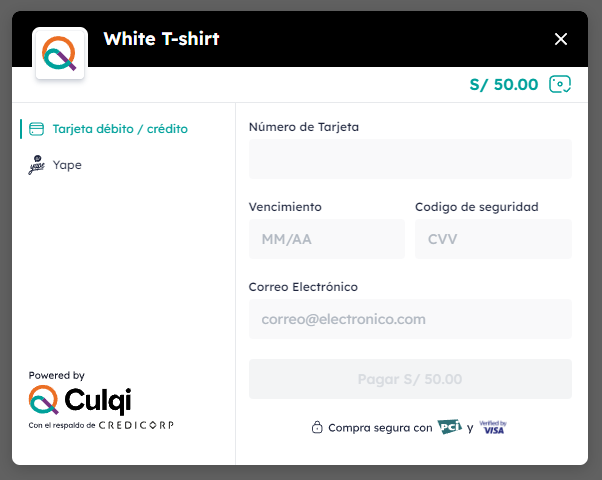
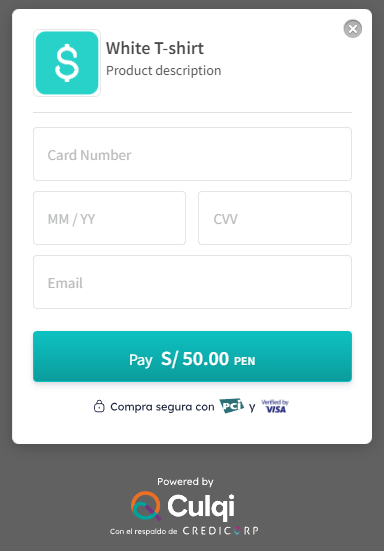

# REACT-CULQI-NEXT

A React library for integration with the Culqi payment processor, compatible with Next.js

## Installation

```bash
npm install react-culqi-next
```

## Usage

### Last version



```js
import { useState } from 'react';
import { CulqiProvider, useCheckout } from 'react-culqi-next';

const MyApp = () => {
  return (
    <CulqiProvider publicKey="pk_test_4YrVwTo....your_public_key">
      <MyButton />
    </CulqiProvider>
  );
};

const MyButton = () => {
  const [amount, setAmount] = useState(10000);
  const [title, setTitle] = useState('White T-shirt');

  const { openCulqi, token, error } = useCheckout({
    settings: {
      title: title,
      currency: 'PEN',
      amount: amount,
      //optional
      options: {
        lang: 'auto',
        installments: false,
        paymentMethods: {
          tarjeta: true,
          yape: true,
        },
        style: {
          logo: '',
          bannerColor: '',
          buttonBackground: '',
          buttonText: '',
          buttonTextColor: '',
          linksColor: '',
          menuColor: '',
          priceColor: '',
        },
      },
    },
    onClose: () => {
      console.log('Handle the closing of the modal');
    },
    onToken: token => {
      console.log('Send your token to the backend', token);
    },
    onError: error => {
      console.log('handle the errors', error);
    },
  });

  return (
    <>
      <button onClick={openCulqi}>Pay now</button>
    </>
  );
};
```

### Version 3



```js
//version 3
import { useState } from 'react';
import { CulqiProviderV3, useCheckoutV3 } from 'react-culqi-next';

const MyApp = () => {
  return (
    <CulqiProviderV3 publicKey="pk_test_4YrVwTo....your_public_key">
      <MyButton />
    </CulqiProviderV3>
  );
};

const MyButton = () => {
  const [amount, setAmount] = useState(10000);
  const [title, setTitle] = useState('White T-shirt');

  const { openCulqi, token, error } = useCheckoutV3({
    settings: {
      title: title,
      currency: 'PEN',
      description: '',
      amount: amount,
      //optional
      options: {
        lang: 'auto',
        installments: false,
        customButton: '',
        modal: true,
        style: {
          buttontext: '',
          desctext: '',
          logo: '',
          maincolor: '',
          maintext: '',
        },
      },
    },
    onClose: () => {
      console.log('Handle the closing of the modal');
    },
    onToken: token => {
      console.log('Send your token to the backend', token);
    },
    onError: error => {
      console.log('handle the errors', error);
    },
  });

  return (
    <>
      <button onClick={openCulqi}>Pay now</button>
    </>
  );
};
```

## Contributing

Pull requests are welcome. For major changes, please open an issue first
to discuss what you would like to change.

Please make sure to update tests as appropriate.

## License

[MIT](https://choosealicense.com/licenses/mit/)
