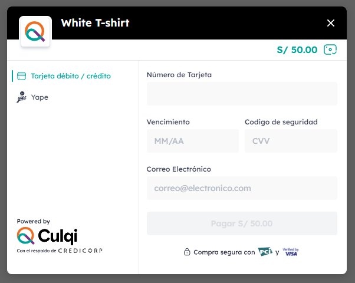

# REACT-CULQI-NEXT

A React library for integration with the Culqi payment processor, compatible with Next.js.

## Installation

```bash
npm install react-culqi-next
```

## Development

This project uses modern tooling for better development experience:

- **Build System**: TSUP (fast TypeScript bundler)
- **Testing**: Jest with React Testing Library
- **Linting**: ESLint with TypeScript and React rules
- **Type Checking**: TypeScript 5.x

### Scripts

```bash
# Development (watch mode)
npm run dev

# Build for production
npm run build

# Run tests
npm run test

# Lint code
npm run lint

# Fix linting issues
npm run lint:fix

# Type checking
npm run typecheck

# Clean build directory
npm run clean
```

## Usage

### Culqi Checkout Custom (Recommended)

This is the newer integration method which offers more customization and better control.

```tsx
import { useState } from 'react';
import { CulqiProviderCustom, useCheckoutCustom } from 'react-culqi-next';

const MyApp = () => {
  return (
    <CulqiProviderCustom publicKey="pk_test_4YrVwTo....your_public_key">
      <MyButton />
    </CulqiProviderCustom>
  );
};

const MyButton = () => {
  const [amount, setAmount] = useState(10000); // Amount in cents (S/ 100.00)

  const { openCulqiCustom, token, error } = useCheckoutCustom({
    settings: {
      title: 'White T-shirt',
      currency: 'PEN',
      amount: amount,
      // Optional: order ID for other payment methods (Yape, Cuotéalo, etc.)
      // order: 'ord_live_0CjjdWhFpEAZlxlz',
    },
    options: {
      lang: 'auto',
      installments: false,
      paymentMethods: {
        tarjeta: true,
        yape: true,
      },
      // appearance customization
      // appearance: { ... }
    },
    onClose: () => {
      console.log('Checkout closed');
    },
    onToken: (token) => {
      console.log('Token created:', token);
    },
    onError: (error) => {
      console.error('Error:', error);
    },
  });

  return (
    <>
      <button onClick={openCulqiCustom}>Pay with Custom Checkout</button>
      {error && <p style={{ color: 'red' }}>{error.user_message}</p>}
    </>
  );
};
```

### Version 4 (Legacy)



> **Note**: Culqi has announced that Checkout v4 might be deprecated in the future. Consider using Checkout Custom for new integrations.

```tsx
import { useState } from 'react';
import { CulqiProvider, useCheckout } from 'react-culqi-next';

const MyApp = () => {
  return (
    <CulqiProvider publicKey="pk_test_4YrVwTo....your_public_key">
      <MyButton />
    </CulqiProvider>
  );
};

const MyButton = () => {
  const [amount, setAmount] = useState(10000);
  const [title, setTitle] = useState('White T-shirt');

  const { openCulqi, token, error } = useCheckout({
    settings: {
      title: title,
      currency: 'PEN',
      amount: amount,
      options: {
        lang: 'auto',
        installments: false,
        paymentMethods: {
          tarjeta: true,
          yape: true,
        },
      },
    },
    onClose: () => {
      console.log('Handle the closing of the modal');
    },
    onToken: (token) => {
      console.log('Send your token to the backend', token);
    },
    onError: (error) => {
      console.log('handle the errors', error);
    },
  });

  return (
    <>
      <button onClick={openCulqi}>Pay now</button>
      {/* token y error disponibles para manejar estados */}
    </>
  );
};
```

## Contributing

Pull requests are welcome. For major changes, please open an issue first
to discuss what you would like to change.

Please make sure to update tests as appropriate.

## License

[MIT](https://choosealicense.com/licenses/mit/)
